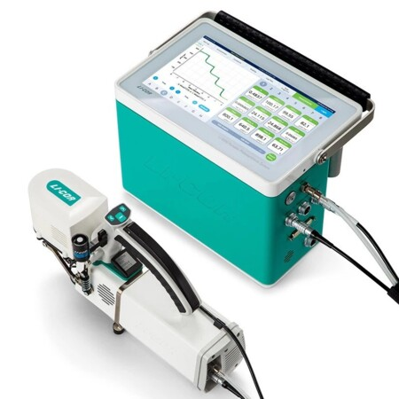

# No sé que poner aquí

Hola hola, voy a usar las *mismas gráficas* que en la actividad anterior porque soy super **poco imaginativa** a veces. 

## Nueva sección

Sigo sin saber que poner aquí solo quiero modificar el texto, ¿Por qué los programadores odian la naturaleza?
Porque tiene demasiados bugs y ninguno está documentado, tum tum tssss. Por cierto le he cambiado el color a las gráficas (invertido) para modificar el código, por si no se notaba.

```{r fig.irga, fig.cap="Sistema LI-6800 Portable Photosynthesis System", echo=FALSE, fig.align='center', out.width='60%'}

```

```{r, message=FALSE, warning=FALSE}
library(readxl)
datos <- read_excel("medidas_irga_lechugas.xlsx")
```

```{r, message=FALSE, warning=FALSE}
#Para calcular las medias de cada bloque y hacer las gráficas necesito instalar estos paquetes
library(ggplot2)
library(dplyr)
```

```{r, message=FALSE, warning=FALSE}
#Aquí estoy haciendo las medias del primer bloque para luego representarlas gráficamente
bloque1 <- datos[1:60, ]
medias_subbloques1 <- data.frame(
  Subbloque = c("CT156", "AZ156", "CM156"),
  Media_E = c(
    mean(bloque1$E[1:20]),
    mean(bloque1$E[21:40]),
    mean(bloque1$E[41:60])
  )
)

medias_subbloques1$Subbloque <- factor(
  medias_subbloques1$Subbloque,
  levels = c("CT156", "AZ156", "CM156")
)
#Con esto estoy graficando los resultados de las medias
ggplot(medias_subbloques1, aes(x = Subbloque, y = Media_E, fill = Subbloque)) +
  geom_bar(stat = "identity") +
  labs(title = "Tasa de transpiración en concentración media de Nd",
       x = "Tratamientos",
       y = "Medida de E (mmol H$_2$O m$^{-2}$ s$^{-1}$)") +
  theme_minimal() +
  scale_fill_brewer(palette = "Reds") +
  theme(legend.position = "none")
```


# -----------------------------------------------------------------------
# BLOQUE 2 (filas 61-120)
# -----------------------------------------------------------------------
```{r, message=FALSE, warning=FALSE}
#Ahora hacemos lo mismo que en el bloque 1
bloque2 <- datos[61:120, ]

medias_subbloques2 <- data.frame(
  Subbloque = c("CT156", "AZ156", "CM156"),  
  Media_E = c(
    mean(bloque2$E[1:20]),   # filas 61-80 → CT156
    mean(bloque2$E[21:40]),  # filas 81-100 → AZ156
    mean(bloque2$E[41:60])   # filas 101-120 → CM156
  )
)

medias_subbloques2$Subbloque <- factor(medias_subbloques2$Subbloque, 
                                       levels = c("CT156", "AZ156", "CM156"))

ggplot(medias_subbloques2, aes(x = Subbloque, y = Media_E, fill = Subbloque)) +
  geom_bar(stat = "identity") +
  labs(title = "Tasa de transpiración en concentración media de Nd",
       x = "Tratamientos",
       y = "Medida de E (mmol H$_2$O m$^{-2}$ s$^{-1}$)") +
  theme_minimal() +
  scale_fill_brewer(palette = "Blues") +
  theme(legend.position = "none")  
```

## Tabla de medias de E por bloque y tratamiento
```{r, message=FALSE, warning=FALSE}
library(knitr)
library(dplyr)
```
# -----------------------------------------------------------------------
# Bloque 1
# -----------------------------------------------------------------------
```{r, message=FALSE, warning=FALSE}
bloque1 <- datos[1:60, ]

tabla_bloque1 <- data.frame(
  Bloque = "Bloque 1",
  Tratamiento = c("CT156", "AZ156", "CM156"),
  Media_E = c(
    mean(bloque1$E[1:20]),
    mean(bloque1$E[21:40]),
    mean(bloque1$E[41:60])
  )
)
```
# -----------------------------------------------------------------------
# Bloque 2
# -----------------------------------------------------------------------
```{r, message=FALSE, warning=FALSE}

bloque2 <- datos[61:120, ]

tabla_bloque2 <- data.frame(
  Bloque = "Bloque 2",
  Tratamiento = c("CT156", "AZ156", "CM156"),
  Media_E = c(
    mean(bloque2$E[1:20]),
    mean(bloque2$E[21:40]),
    mean(bloque2$E[41:60])
  )
)
```
# -----------------------------------------------------------------------
## Tabla procesada a partir de un código:
# -----------------------------------------------------------------------
```{r, message=FALSE, warning=FALSE}
tabla_final <- rbind(tabla_bloque1, tabla_bloque2)

kable(tabla_final, digits = 4)

```
